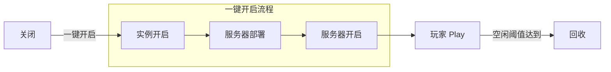

# 进入服务器

Seatide 服务器基于阿里云 ECS 抢占式实例，服务器不是常驻运行的，而是根据需要，由玩家自助开启，自行游玩，在无人（空闲）时被平台自动回收。

## 服务器的生命周期

## 如何一键开启服务器

:::warning[你需要有白名单才能进行任何操作]
服务器控制台只支持白名单玩家进行操作，否则你只能查阅一些基础信息。如果你对白名单有任何疑问，请阅读[加入服务器前的准备事宜](./prerequisites.md)。
:::

服务器的一键开启功能是开放给所有玩家使用的，因此如果你想要进入世界却发现服务器没有运行，就可以自行到[服务器控制台](https://st.subilan.win) `https://st.subilan.win` 自助开服。点击「一键创建」后，系统将自动拉取存档并启动服务器，随后你便可以使用域名或者 IP 地址加入服务器。

### 注册控制台

要在控制台上进行操作，需要有一个控制台账号。你可以跟随以下步骤花一分钟左右的时间注册一个账号。

1.  前往控制台注册页面 https://st.subilan.win/#/lor
2.  点击「创建账号」，填写并提交。账号的用户名需要是独一无二的，可以使用你的游戏名。
3.  注册完毕后，用密码登录控制台。

### 绑定游戏名

成功登录平台后，需要让平台知道你已经获取了白名单。在右上角点击「我的账号」，进入后点击「立即绑定」，输入你的游戏名（区分大小写）确定后即可完成绑定。

:::danger[请务必绑定自己的游戏名]
此步不设验证，全凭自觉。已经绑定的游戏名不可重复绑定，因此请务必绑定自己的游戏名。如果出现错误绑定的情况，请主动解除绑定或修改（绑定完毕后会有相关按钮）。若存在故意占用他人游戏名的情况，查实后将直接作**删号 + 封禁**处理。
:::

如果你已经有白名单，此时就可以进行实践操作了。

### 触发「一键创建」流程

单击页面上的「一键创建」并确认，等待 2~5 分钟之后，即可使用域名或 IP 地址进入服务器。
